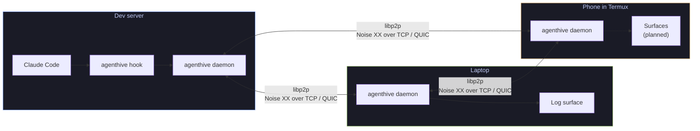
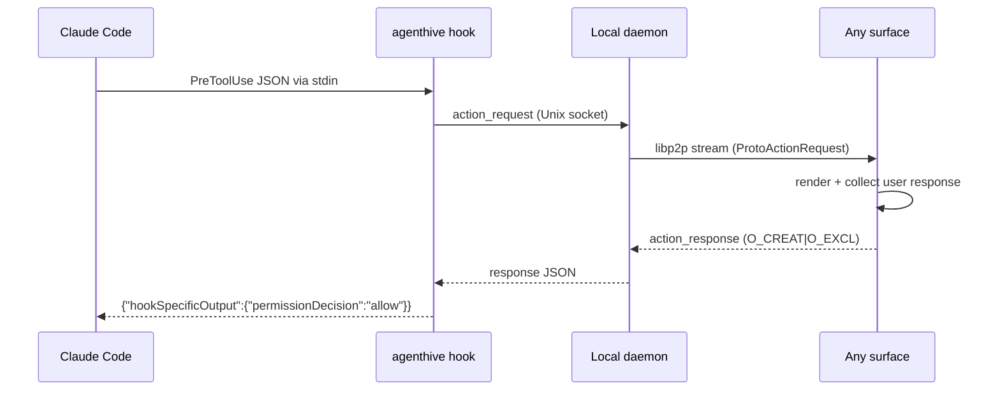
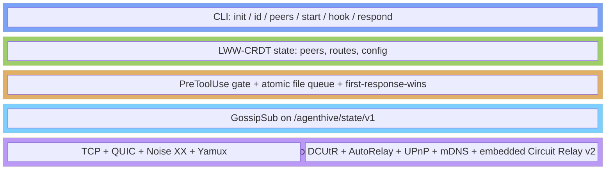

<div align="center">

# agenthive

**Encrypted, peer-to-peer mesh for AI agent notification and control.**

[](https://github.com/shaiknoorullah/agenthive/actions/workflows/ci.yml)
[](https://goreportcard.com/report/github.com/shaiknoorullah/agenthive)
[](https://pkg.go.dev/github.com/shaiknoorullah/agenthive)
[](LICENSE)
[](https://github.com/shaiknoorullah/agenthive/releases)

Approve Claude Code from your phone in under a second.
No cloud. No broker. Your machines, talking directly over libp2p.

[Quick Start](#quick-start) · [How It Works](#how-it-works) · [Status](#status) · [Architecture](#architecture) · [Contributing](CONTRIBUTING.md)

</div>

---

Your AI agents run on a dev server. You're on a train. Your phone buzzes:

> **Claude wants to run:** `rm -rf /tmp/build`
>
> **\[Allow\]** **\[Deny\]**

You tap Allow. Claude proceeds. No cloud service touched the message.

agenthive turns every device you own into a coordination node for your AI agents.

---

## Why agenthive

- **Approve actions from anywhere.** Claude Code's `PreToolUse` hook routes through your own mesh to whichever device is in your hand — server, laptop, phone in Termux. First responder wins, atomic file-create as the race primitive. The agent never sees a fingerprint prompt, never blocks on a keystroke.

- **State syncs without consensus.** Routing rules, peer presence, and config are LWW-CRDTs over Hybrid Logical Clocks. Edit on your phone in airplane mode; it reconciles when you reconnect. No leader, no quorum, no split-brain.

- **No infrastructure to run.** No cloud, no broker, no rendezvous server, no STUN, no TURN, no control plane. Every agenthive node also ships a libp2p Circuit Relay v2 — whichever of *your own* peers happens to have a public address picks up the relay role automatically.

- **Battle-tested wire.** Transport, identity, encryption, multiplexing, and NAT traversal are handled by [go-libp2p](https://github.com/libp2p/go-libp2p) — the same stack securing the consensus layer of Ethereum, Filecoin, and Optimism.

---

## Status

Honest snapshot of what ships today and what's next.

| Subsystem | Status |
|---|---|
| libp2p Host: TCP + QUIC, Noise XX, Yamux, IPv4 + IPv6 | shipped |
| NAT traversal: DCUtR, AutoRelay, UPnP / NAT-PMP | shipped |
| Embedded Circuit Relay v2 on every node | shipped |
| mDNS for zero-config LAN peer discovery | shipped |
| CRDT state sync via GossipSub on `/agenthive/state/v1` | shipped |
| Action gate via Claude Code `PreToolUse` hook | shipped |
| Destructive-action classifier (30s TTL on `rm -rf`, `DROP TABLE`, etc.) | shipped |
| Atomic first-response-wins (`O_CREAT\|O_EXCL` file queue) | shipped |
| CLI: `init`, `id`, `peers add\|list`, `start`, `hook`, `respond` | shipped |
| Log surface (line-delimited JSON) | shipped |
| tmux per-pane surface (zero-fork status line) | next |
| Desktop notifications (notify-send / osascript) | next |
| Bubbletea TUI: peers, routes, actions, logs | next |
| Termux push surface | planned |
| ntfy, Slack, Discord, PWA surfaces | planned |
| Signed GossipSub messages with per-peer key validation | planned |

No pre-built binaries yet — build from source. The CLI works, the daemon works, two-peer CRDT convergence is tested. The action gate is end-to-end functional with the log surface; richer surfaces are the next push.

---

## Quick Start

### Install

```bash
go install github.com/shaiknoorullah/agenthive/cmd/agenthive@latest
```

Requires Go 1.22+. Drops `agenthive` into `$GOPATH/bin`.

### Two-peer mesh in five minutes

On **device A** (your laptop):

```bash
agenthive init                # generate an Ed25519 identity in ~/.config/agenthive/identity.key
agenthive id                  # print this peer's listening multiaddrs
# /ip4/192.168.1.10/tcp/9123/p2p/12D3KooWAbCdEf...
# /ip4/192.168.1.10/udp/9123/quic-v1/p2p/12D3KooWAbCdEf...
agenthive start               # start the daemon; blocks until ^C
```

On **device B** (your dev server, or a phone in Termux):

```bash
agenthive init
agenthive peers add /ip4/192.168.1.10/tcp/9123/p2p/12D3KooWAbCdEf...
agenthive start
```

Both daemons gossip CRDT state on topic `/agenthive/state/v1`. Mutate a peer entry on one — the other converges within a round trip. mDNS will also auto-discover same-LAN peers without `peers add`.

### Wire it into Claude Code

In `~/.claude/settings.json`:

```json
{
  "hooks": {
    "PreToolUse": [
      {
        "matcher": ".*",
        "hooks": [
          { "type": "command", "command": "agenthive hook PreToolUse", "timeout": 310 }
        ]
      }
    ]
  }
}
```

Now every Bash, Write, or Edit by Claude routes through the local agenthive daemon. The daemon classifies the tool input (destructive → 30s TTL, normal → 300s), dispatches the action request to every configured surface, and blocks for the response.

While the dedicated surfaces are still being built, respond manually:

```bash
agenthive respond <action-id> allow
# or: agenthive respond <action-id> deny
```

**Fail-open by design.** If the daemon is unreachable or the gate times out, the hook returns nothing and Claude falls back to its built-in permission prompt. agenthive never blocks the agent indefinitely.

---

## How It Works

Each device runs one binary. There is no client/server split.



Three things are happening at once.

**1. Identity & transport.** PeerID is the SHA-256 multihash of the Ed25519 public key — deterministic, no registration, no CA. Multiaddrs include both TCP and QUIC on both IPv4 and IPv6. Every connection runs Noise XX for mutual authentication and ChaCha20-Poly1305 encryption.

**2. State diffusion.** A `StateStore` of three LWW-Maps (peers, routes, config) keyed by HLC timestamps. Mutations stamp locally and broadcast as `StateDelta` messages on GossipSub. Receivers merge — last-writer-wins per key, tombstones for deletes, peer-ID lexicographic tiebreak. Total order under partial connectivity.

**3. Action gate.** Claude Code's `PreToolUse` hook calls `agenthive hook PreToolUse`. The CLI dials the local daemon's Unix socket with the action request. The daemon fans out via per-protocol libp2p streams to all configured action surfaces and polls for `<action-id>.response`. First atomic file-create wins; all other surfaces get `EEXIST` and silently exit their prompts. The gate unblocks, deletes the file, and emits the JSON Claude expects.



---

## Architecture



### NAT traversal — every avenue, fail-soft

When daemon A wants to talk to daemon B, libp2p tries these in parallel and races them:

1. **Direct LAN dial** — mDNS-discovered, both peers on the same network.
2. **Direct WAN dial** — peer advertises a public address (AutoNAT-confirmed, propagated through the CRDT).
3. **UPnP / NAT-PMP-mapped port** — when the home router cooperates.
4. **DCUtR hole-punch** — both peers behind NAT, coordinated via a relay; ~70% direct-success rate in 2025 ProbeLab measurements.
5. **Relayed dial** — via Circuit Relay v2 on any of your own peers with a reachable address.

First success wins. The relay used in (4) and (5) is *not external infrastructure*. Every agenthive node ships with `EnableRelayService()` on, so whichever of your peers — dev server, cloud VPS, IPv6-enabled phone, home box with port-forward — happens to be reachable picks up the role automatically. You are not "running a relay." You are running agenthive.

### Security model

| Layer | Mechanism |
|---|---|
| Identity | Ed25519 keypair persisted as `~/.config/agenthive/identity.key`, mode 0600 |
| Wire encryption | Noise XX (ChaCha20-Poly1305) on every libp2p connection |
| Authentication | PeerID derived from pubkey; Noise XX requires private-key proof — no CA, no fingerprints |
| Authorization | CRDT peer allow-list; GossipSub validator drops messages from unknown peers |
| Action gate | Cryptographic action IDs (`crypto/rand`); 30s TTL for destructive actions, 300s default; atomic `O_CREAT\|O_EXCL` as first-response-wins primitive |
| Persistence | `~/.config/agenthive/` mode 0700; state file `state.json` with atomic temp-file rename |

See [SECURITY.md](SECURITY.md) for vulnerability reporting.

---

## Tech Stack

| Component | Choice |
|---|---|
| Language | Go 1.22 |
| Transport, identity, discovery, NAT | [go-libp2p](https://github.com/libp2p/go-libp2p) |
| State diffusion | [go-libp2p-pubsub](https://github.com/libp2p/go-libp2p-pubsub) (GossipSub v1.2) |
| CRDT data layer | LWW-Register + LWW-Map over HLC, in-house (`internal/crdt/`) |
| CLI | [cobra](https://github.com/spf13/cobra) |
| Serialization | JSON, length-prefixed on streams |
| Tests | [testify](https://github.com/stretchr/testify) + [rapid](https://pkg.go.dev/pgregory.net/rapid) (property + native Go fuzz) |
| CI gate | `go test -race -count=1 ./...`, `go vet`, `golangci-lint`, 30s fuzz on CRDT |

---

## Project Layout

```
agenthive/
├── cmd/agenthive/              # cobra CLI: init, id, peers, start, hook, respond
├── internal/
│   ├── crdt/                   # LWW-Register, LWW-Map, HLC, StateStore (data layer)
│   ├── identity/               # Ed25519 keypair persistence
│   ├── transport/              # libp2p Host construction
│   ├── discovery/              # mDNS LAN discovery
│   ├── protocols/              # stream protocol IDs, message types, framing
│   ├── hooks/                  # action gate, file queue, destructive classifier
│   ├── dispatch/               # Surface interface + log surface
│   └── daemon/                 # Run loop + Unix socket for hook IPC
└── docs/
    ├── rfcs/                   # design RFCs (incl. the libp2p adoption decision)
    └── superpowers/plans/      # implementation plans
```

---

## Design Rationale

Every load-bearing decision has a written record. agenthive uses adversarial-debate RFCs for hard architectural choices: each option gets an advocate paper, a judge synthesizes, the verdict is filed alongside.

| Document | Decides |
|---|---|
| `docs/rfcs/adopt-libp2p.md` | Transport, identity, discovery, NAT (current) |
| `docs/rfcs/debate-{libp2p,quic-mtls,yggdrasil}-advocate.md` | Adversarial debate that informed the libp2p decision |
| `docs/rfcs/action-buttons-research.md` | Bidirectional approval surface model |
| `docs/rfcs/feature-research.md` | Feature roadmap |
| `docs/rfcs/code-analysis.md` | Lessons from the shell-based predecessor |
| `docs/rfcs/debate-transport-judgment.md` | Original SSH+gossip judgment (superseded by `adopt-libp2p.md`) |
| `docs/rfcs/debate-judgment.md` | Phase-1 verdict: native tmux options over file-based IPC |

The most recent decision is the [libp2p adoption RFC](docs/rfcs/adopt-libp2p.md), which collapses the previously-planned bespoke transport (SSH tunnels + autossh + custom pairing + hand-rolled Noise framing) into a single `libp2p.New(...)` call plus stream handlers.

---

## Contributing

PRs welcome. See [CONTRIBUTING.md](CONTRIBUTING.md) for the testing requirements (TDD; CRDT changes need property tests).

```bash
git clone https://github.com/shaiknoorullah/agenthive.git
cd agenthive
go build ./...
go test -race -count=1 ./...
```

---

## License

[MIT](LICENSE)
