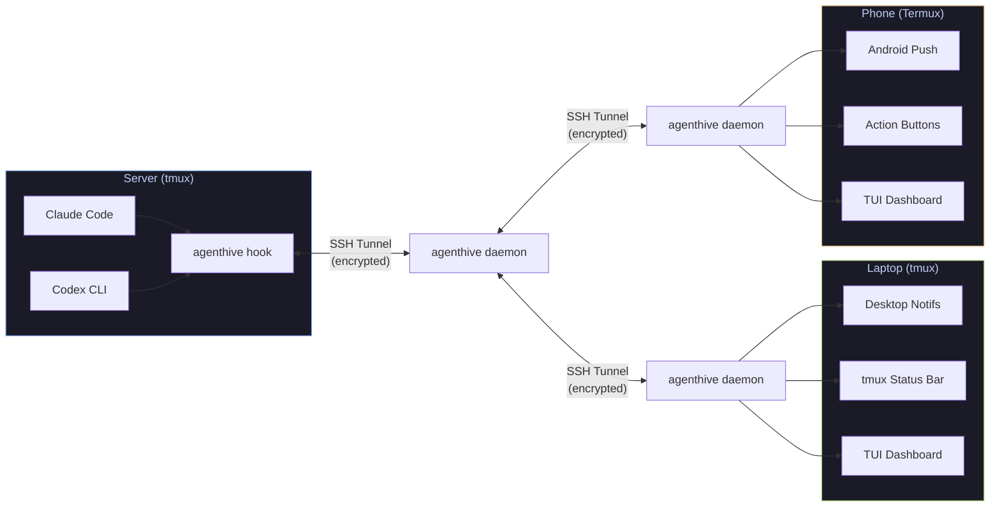
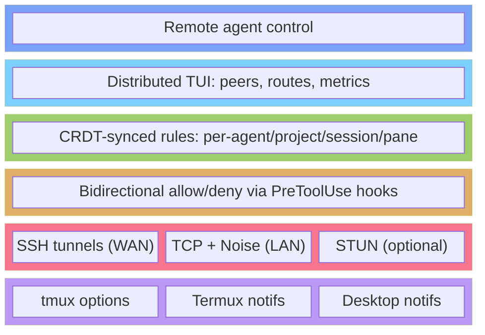
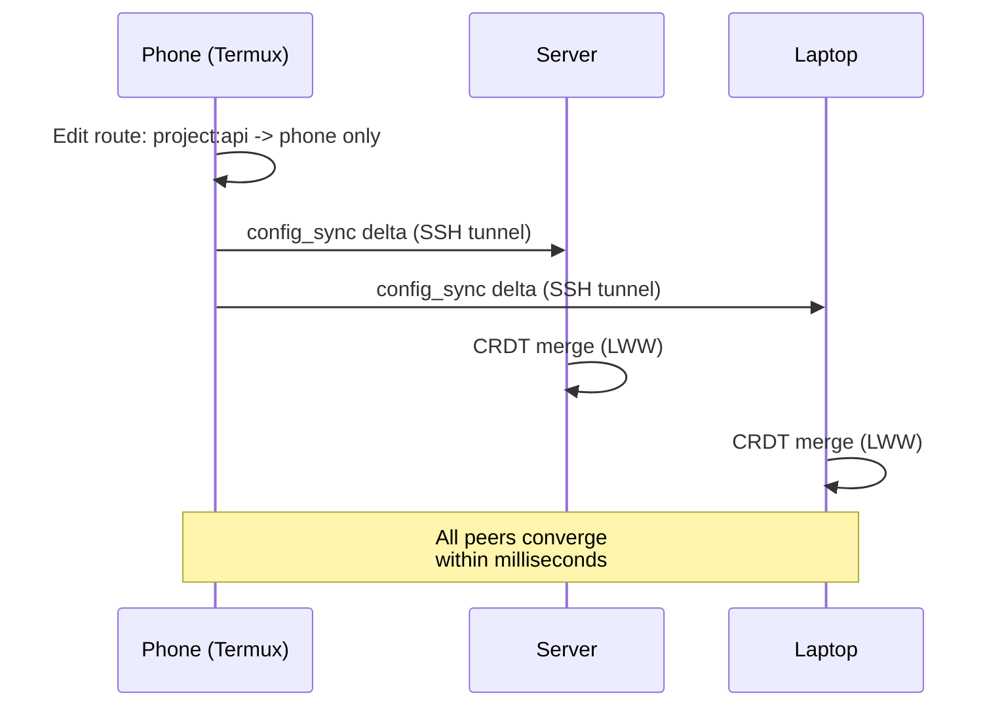
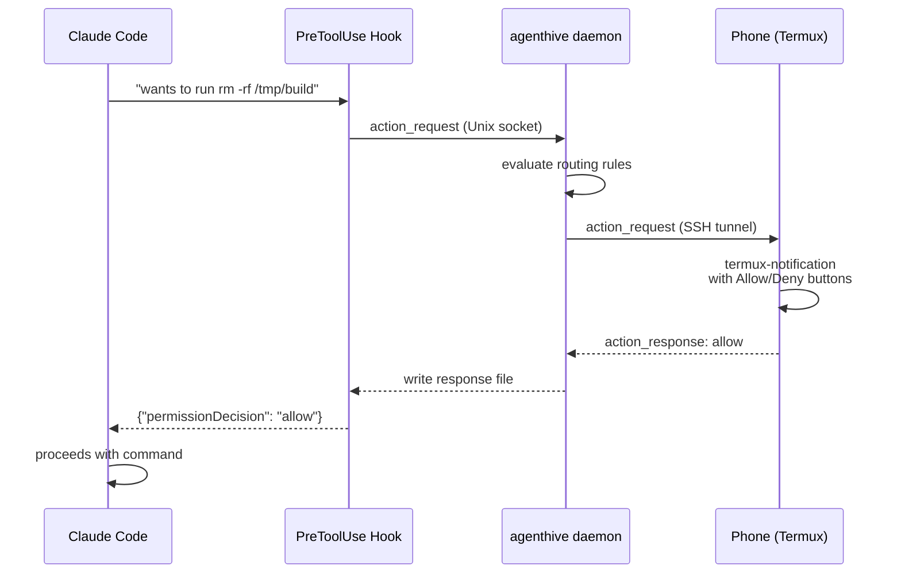

<div align="center">

# agenthive

**A self-hosted, encrypted mesh for AI agent notification and control.**

[](https://github.com/shaiknoorullah/agenthive/actions/workflows/ci.yml)
[](https://goreportcard.com/report/github.com/shaiknoorullah/agenthive)
[](https://pkg.go.dev/github.com/shaiknoorullah/agenthive)
[](LICENSE)
[](https://github.com/shaiknoorullah/agenthive/releases)

Get notifications, approve actions, and control your AI coding agents from anywhere --
your server, your laptop, or your phone. No cloud. No intermediaries. Just your machines, talking directly.

[Getting Started](#getting-started) |
[Features](#features) |
[Architecture](#architecture) |
[Contributing](CONTRIBUTING.md)

</div>

---

Your AI agents run on a server at home. You're on the bus. Your phone buzzes:

> **Claude wants to run:** `rm -rf /tmp/build`
>
> **\[Allow\]** **\[Deny\]**

You tap Allow. Claude proceeds. No cloud service touched the message.

agenthive turns every terminal into a command center for your agents.

## How It Works



Every device runs the same `agenthive` daemon. Every device is an equal peer. Change a routing rule on your phone -- the server learns instantly.

## Features

### Reach You Anywhere

- **tmux status bar** -- native per-pane notifications with zero shell forks
- **Desktop** -- `notify-send` on Linux, `osascript` on macOS
- **Android** -- native push notifications with action buttons via Termux
- **Audio** -- terminal bell, system sounds, or custom audio files

### Bidirectional Agent Control

- **Action buttons** -- approve or deny agent permission requests from any device
- **Remote commands** -- tell agents on remote servers what to do from your phone
- **Hook-native** -- uses Claude Code's `PreToolUse` hook for programmatic allow/deny, no keystroke injection

### Intelligent Routing

```bash
agenthive routes add "project:api-server -> phone, laptop"
agenthive routes add "session:refactor -> telegram"
agenthive routes add "priority:critical -> ALL"
agenthive routes add "source:Codex -> desktop-only"
```

Route notifications per-agent, per-project, per-session, per-window, or per-pane. Rules sync across all peers automatically via CRDTs.

### Distributed Mesh Management

Manage peers, routes, and configuration from **any** connected device. The TUI works identically in tmux and Termux.

```
+===============================================================+
|  Peers                                                        |
|  * dev-server     online   12ms   5 agents   43 msgs today    |
|  * macbook-pro    online    3ms   2 agents   18 msgs today    |
|  * pixel-phone    online   45ms   0 agents    7 msgs today    |
|  o work-desktop   offline  --     last seen 2h ago            |
|                                                               |
|  Routes                                                       |
|  api-server/*      -> phone, laptop                           |
|  session:refactor  -> telegram                                |
|  priority:critical -> ALL                                     |
|                                                               |
|  [p]eers  [r]outes  [m]etrics  [a]dd device  [q]uit           |
+===============================================================+
```

### Smart Local Notifications

Built on native tmux per-pane options -- not filesystem polling:

- **Atomic** -- no race conditions, no dual-file writes
- **Zero-fork** -- status line renders via tmux format strings, not shell commands
- **O(1) clearing** -- inline hook, no directory scanning
- **Auto-cleanup** -- pane destruction clears notifications automatically
- **Worktree-aware** -- shows `project/worktree` for git worktrees

### Priority Levels

```
[14:30] Claude/api-server: Task failed        <- red, bold (critical)
[14:31] Claude/frontend: Agent has finished   <- default (info)
[14:32] Codex/docs: Needs approval            <- yellow (warning)
```

### Agent State Tracking

```
* api-server   ? frontend   * docs-gen
```

Running, waiting, done -- visible in status bar and dashboard.

### Notification Grouping

When multiple agents in the same project finish simultaneously:

```
[14:30] Claude/my-project: 5 agents finished
```

Expand details in the picker or dashboard.

## Getting Started

### Requirements

- Go 1.22+ (build from source) or grab a [prebuilt binary](https://github.com/shaiknoorullah/agenthive/releases)
- tmux 3.2+
- SSH keys configured
- [fzf](https://github.com/junegunn/fzf) (for notification picker)
- [Termux](https://termux.dev) + [Termux:API](https://wiki.termux.com/wiki/Termux:API) (Android, optional)

### Install

```bash
go install github.com/shaiknoorullah/agenthive@latest
```

Or download a prebuilt binary from [Releases](https://github.com/shaiknoorullah/agenthive/releases) for `linux/amd64`, `linux/arm64`, `darwin/amd64`, `darwin/arm64`.

### Termux (Android)

```bash
pkg install openssh autossh jq
# download the linux/arm64 binary from releases
# install Termux:API from F-Droid for native notifications
```

### tmux Plugin (local notifications only)

```tmux
set -g @plugin 'shaiknoorullah/agenthive'
```

### Quick Start

```bash
# 1. Initialize on every device
agenthive init

# 2. Pair your devices
agenthive pair --remote user@laptop
agenthive pair --remote user@phone:8022    # Termux

# 3. Establish links
agenthive link --to laptop --via ssh
agenthive link --to phone --via ssh

# 4. Start the daemon
agenthive start --daemon

# 5. Configure Claude Code hooks
agenthive hooks install    # adds hooks to ~/.claude/settings.json

# 6. Set up routes
agenthive routes add "priority:critical -> ALL"
agenthive routes add "project:api-server -> phone, laptop"
agenthive routes add "default -> laptop"
```

Done. Your agents are connected to your mesh.

## Usage

### CLI

```bash
# Identity & Pairing
agenthive init                              # generate peer identity
agenthive pair --remote user@host           # pair via SSH
agenthive pair --qr                         # QR code pairing

# Links
agenthive link --to <peer> --via ssh        # SSH tunnel (WAN)
agenthive link --to <peer> --via tcp        # direct TCP (LAN)

# Daemon
agenthive start [--daemon]                  # start mesh daemon
agenthive stop                              # stop daemon
agenthive status                            # peers, links, routes

# Management
agenthive peers                             # list peers with metrics
agenthive routes                            # list routing rules
agenthive routes add "<selector> -> <targets>"
agenthive routes del <route-id>

# Actions
agenthive respond allow:<request-id>        # approve agent action
agenthive respond deny:<request-id>         # deny agent action

# Interface
agenthive tui                               # interactive dashboard

# Hooks
agenthive hook <event>                      # Claude Code hook handler
agenthive hooks install                     # auto-configure Claude Code
```

### tmux Keybindings

| Key | Action |
|-----|--------|
| `prefix + N` | Jump to oldest notification |
| `prefix + S` | Notification picker (fzf) |
| `prefix + D` | Dashboard popup |
| `prefix + Q` | Toggle Do Not Disturb |

### tmux Options

```tmux
set -g @agenthive-key-next 'N'
set -g @agenthive-key-picker 'S'
set -g @agenthive-key-dashboard 'D'
set -g @agenthive-status-line 'on'
set -g @agenthive-desktop-notifs 'on'
set -g @agenthive-sound 'bell'
set -g @agenthive-stale-timeout '1800'
```

## Architecture



### Transport

- **WAN**: SSH reverse tunnels via autossh -- zero new infrastructure
- **LAN**: Direct TCP with Noise Protocol encryption (ChaCha20-Poly1305)
- **Optional**: STUN-assisted connections for SSH-blocked environments

### State Synchronization

Configuration, routing rules, and peer registry use **LWW-Register CRDTs** with Hybrid Logical Clocks. No leader election. No consensus protocol. All peers converge automatically.



### Notification Flow



### Security

| Layer | Encryption | Authentication |
|-------|-----------|----------------|
| WAN links | SSH (AES-256-GCM) | SSH key-based auth |
| LAN links | Noise Protocol (ChaCha20-Poly1305) | Ed25519 peer identity |
| Actions | Cryptographic request IDs + TTL | Per-surface auth |
| Storage | `0700` permissions | Peer-scoped access |

### Supported Agents

| Agent | Hook Integration | Action Buttons |
|-------|-----------------|----------------|
| Claude Code | PreToolUse, Stop, Notification | Allow/Deny via hook JSON |
| Codex CLI | notify callback | Notification only |
| Custom tools | Unix socket or hook library | Full support |

## Tech Stack

| Component | Technology |
|-----------|-----------|
| Daemon | Go (single static binary) |
| TUI | [bubbletea](https://github.com/charmbracelet/bubbletea) + [lipgloss](https://github.com/charmbracelet/lipgloss) |
| Transport | SSH / autossh (WAN), Noise Protocol (LAN) |
| State sync | LWW-Register CRDTs + Hybrid Logical Clocks |
| Serialization | Newline-delimited JSON |
| Notifications | tmux options, notify-send, osascript, termux-notification |

## Project Status

> **Early Development** -- architecture is designed, RFCs are written, implementation is underway.

See `docs/rfcs/` for the full design rationale, including adversarial debates and judge evaluations for every major architectural decision.

## Contributing

Contributions welcome. See [CONTRIBUTING.md](CONTRIBUTING.md) for guidelines.

```bash
git clone https://github.com/shaiknoorullah/agenthive.git
cd agenthive
go build ./...
go test -race ./...
```

## License

[MIT](LICENSE)
