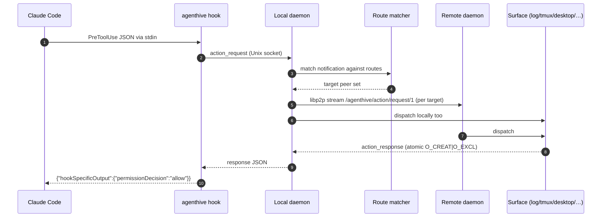
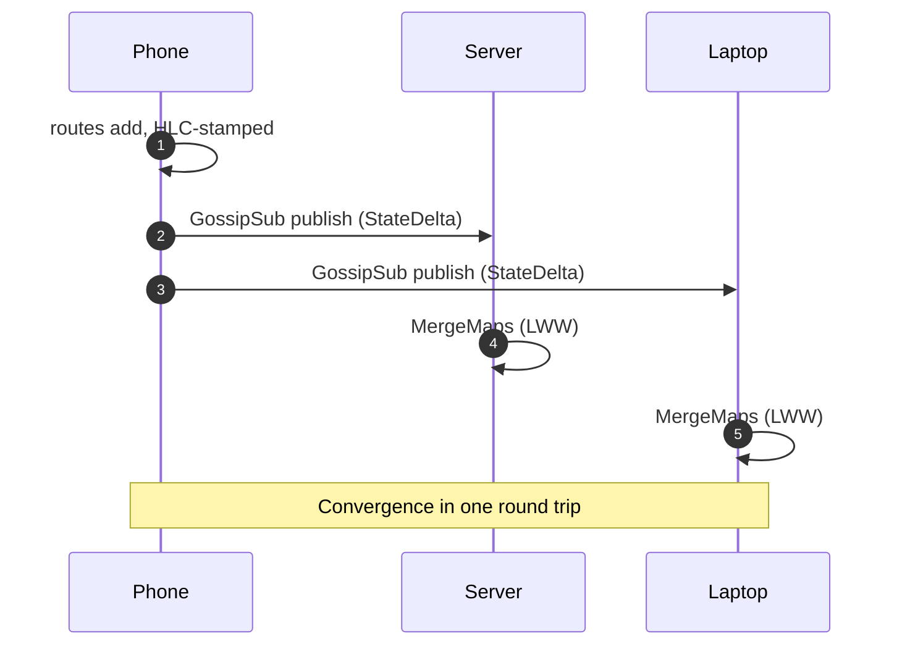

# Architecture

agenthive is one Go binary running on every device you own. There is no client/server split — every node is symmetric.

## The three layers

```mermaid
block-beta
  columns 1
  block:application["Application"]
    CLI["CLI: init / id / peers / routes / start / hook / respond / tui"]
    TUI["TUI: bubbletea — peers / routes / actions / logs"]
  end
  block:coordination["Coordination"]
    Store["LWW-CRDT StateStore (peers, routes, config)"]
    HLC["HLC timestamps {Wall, Counter, PeerID}"]
    Router["Route matcher → target peer set per notification"]
    Gate["Action gate (PreToolUse + atomic file queue + first-response-wins)"]
  end
  block:wire["Wire — go-libp2p"]
    Transports["TCP + QUIC • Noise XX • Yamux"]
    NAT["Identify • AutoNAT v2 • AutoRelay v2 • DCUtR"]
    Mesh["Circuit Relay v2 (every node) • UPnP / NAT-PMP • mDNS"]
    Gossip["GossipSub on /agenthive/state/v1"]
  end

  style application fill:#7aa2f7,color:#1a1b26
  style coordination fill:#9ece6a,color:#1a1b26
  style wire fill:#bb9af7,color:#1a1b26
```

### Wire

go-libp2p owns everything below `Coordination`. PeerID = SHA-256 multihash of the Ed25519 public key. Multiaddrs include both TCP and QUIC on both IPv4 and IPv6. Noise XX runs on every new connection; ChaCha20-Poly1305 frames bytes both directions.

### Coordination

agenthive owns this layer. The CRDT data layer is in `internal/crdt/` — three LWW-Maps (`peers`, `routes`, `config`) keyed by HLC timestamps. Mutations stamp locally and broadcast as `StateDelta` messages on GossipSub topic `/agenthive/state/v1`. Receivers merge per LWW semantics — last writer wins per key, tombstones for deletes, peer-ID lexicographic tiebreak.

The route matcher (`internal/router/`) walks routes and returns target PeerIDs per notification. The action gate (`internal/hooks/`) implements the file-queue + atomic-first-response-wins pattern that lets any surface answer a Claude Code `PreToolUse` request first.

### Application

The CLI lives in `cmd/agenthive/`. The TUI lives in `internal/tui/`, talking to the local daemon over a Unix-domain socket on `<config-dir>/agenthive.sock`.

## What's in the box

| Package | Purpose |
|---|---|
| `internal/crdt/` | LWW-Register, LWW-Map, HLC, StateStore — the data layer |
| `internal/identity/` | Ed25519 keypair persistence (`identity.key`, mode 0600) |
| `internal/transport/` | libp2p Host construction |
| `internal/discovery/` | mDNS LAN peer discovery |
| `internal/protocols/` | Stream protocol IDs, GossipSub topic, framed JSON messages |
| `internal/hooks/` | Action gate, file queue, destructive-action classifier |
| `internal/dispatch/` | Surface interface + log, tmux, desktop surfaces |
| `internal/router/` | Route matcher — turns CRDT routes into target PeerIDs |
| `internal/daemon/` | Run loop wiring everything + Unix socket for hook IPC and TUI |
| `internal/tui/` | Bubbletea TUI (4 tabs) |
| `cmd/agenthive/` | Cobra CLI |
| `tmux/` | TPM-compatible plugin + helper scripts |

## A notification end-to-end

## State convergence end-to-end

## Failure modes

| Scenario | What happens |
|---|---|
| All peers behind hostile NAT, no IPv6, no public peer | WAN dial fails. mDNS still works on a shared LAN. No external workaround offered. |
| DCUtR hole-punch fails | Falls back to Circuit Relay v2 on whichever of your own peers has a reachable address |
| Phone in Doze for 8 hours | libp2p connection times out; daemon reconnects on wake (~2s) and refreshes state via GossipSub catch-up |
| Daemon socket gone | TUI exits with a clear message; hook subcommand exits 0 with no output (Claude falls back to its built-in prompt) |
| `identity.key` exfiltrated | Attacker can impersonate the PeerID; remove from CRDT peer set, generate new identity (see [[Security Model]]) |

## Deeper dives

- [[NAT Traversal]] — the five-path cascade and why it works without external infrastructure
- [[CRDT State Sync]] — LWW semantics, HLC ordering, tombstones, anti-entropy
- [[Action Gate]] — atomic file-queue mechanics and the destructive-action TTL
- [[Security Model]] — threat model and concrete mitigations
