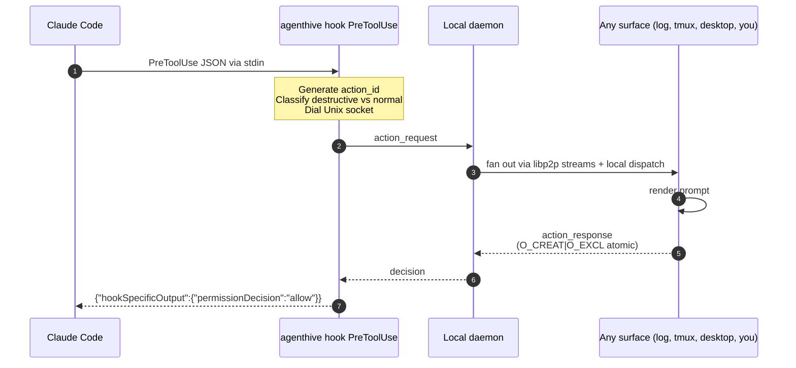
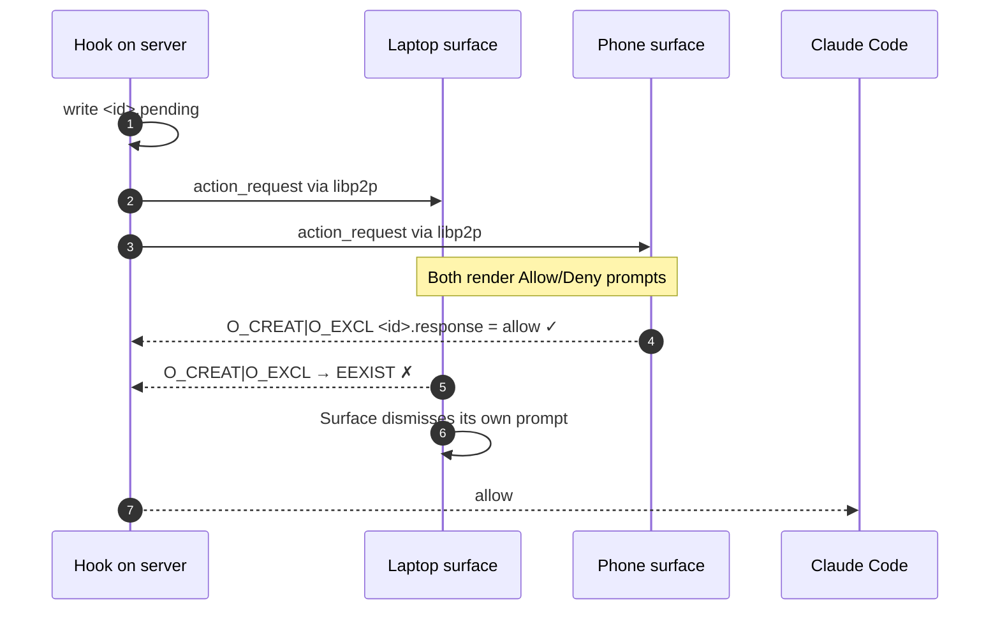

# Claude Code Integration

agenthive routes Claude Code's `PreToolUse` permission requests through your peer-to-peer mesh, so you can approve from any device with the daemon running. The agent never blocks on a keystroke — the hook returns structured JSON.

## How it works



Other surfaces receive the request too, but the first one to write `<action-id>.response` wins. Everybody else gets `EEXIST` and silently exits.

## Setup

### 1. Make sure the daemon is running

```bash
agenthive start
```

(Or run under `systemd` / `tmux` / `screen` for background operation.)

### 2. Add the hook to `~/.claude/settings.json`

```json
{
  "hooks": {
    "PreToolUse": [
      {
        "matcher": ".*",
        "hooks": [
          {
            "type": "command",
            "command": "agenthive hook PreToolUse",
            "timeout": 310
          }
        ]
      }
    ]
  }
}
```

The `310` timeout is ten seconds beyond agenthive's internal 300s default so Claude doesn't kill the hook process before agenthive can return.

### 3. Trigger a PreToolUse event

Open a Claude Code conversation and let Claude try to run a tool. You should see the action request reflected in:

- `agenthive tui` → Actions tab
- The daemon log file (default surface)

### 4. Respond

Until tmux / desktop / phone surfaces are wired into your daily flow, respond manually:

```bash
agenthive respond <action-id> allow
# or
agenthive respond <action-id> deny
```

Or use the TUI's `y` / `n` keys on the Actions tab.

## Destructive action handling

agenthive classifies the tool input against a curated list of dangerous patterns (`rm -rf`, `git push --force`, `DROP TABLE`, `mkfs`, `chmod 777`, etc.). When a match hits:

- TTL drops from the default **300s** to **30s** — destructive actions auto-deny if you don't act quickly.
- The action shows up with a `destructive` flag in surface dispatches.

Substring matching is intentional. `rm -rf .DS_Store` still trips the destructive path because an extra confirmation prompt is cheaper than an unconfirmed `rm -rf`.

To see the full pattern list, read `internal/hooks/security.go` in the repo.

## Fail-open guarantee

If the daemon is unreachable, the action gate times out, or anything else goes wrong inside the hook subcommand, the hook prints **nothing** and exits **0**. Claude Code falls back to its built-in permission prompt as if no hook existed.

This is by design. agenthive is supposed to **augment** Claude's permission flow, not break it.

## Multi-device convergence

When more than one peer's surface receives the request, only one will succeed at writing the response. The `O_CREAT|O_EXCL` flag on the response file is a kernel-level atomic create-if-not-exists — there is no race, no half-state, no "both said allow."



## Codex CLI

Codex CLI's notify callback is supported by the same machinery — the `agenthive hook` subcommand reads the event type from stdin and dispatches accordingly. v0.1.0 supports `PreToolUse` for Claude Code; Codex parity is on the v0.2.0 roadmap.

## Custom tools

Any program that can read JSON from stdin and write JSON to stdout can be wrapped as an agenthive hook. The minimum payload format:

```json
{
  "hook_event": "PreToolUse",
  "tool": "Bash",
  "input": "rm -rf /tmp/foo",
  "session_id": "abc",
  "tool_use_id": "xyz"
}
```

The hook responds with:

```json
{"hookSpecificOutput": {"permissionDecision": "allow"}}
```

or `"deny"`.

## See also

- [[Action Gate]] — internals of the file queue
- [[Routing]] — direct different tool prefixes / sessions to different surfaces
- [[Troubleshooting]] — when the hook doesn't fire or the daemon doesn't see the request
